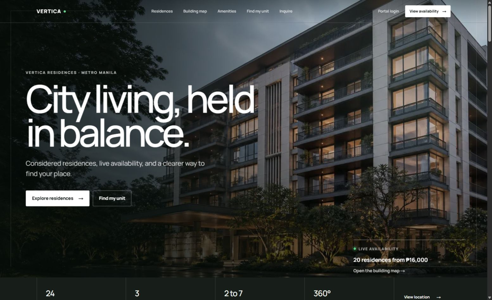
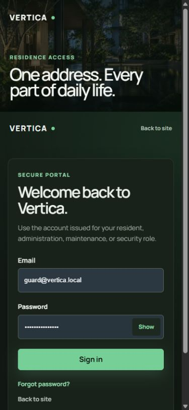
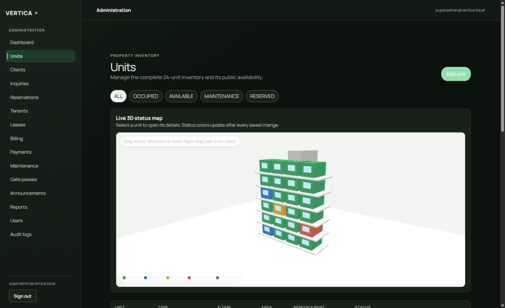
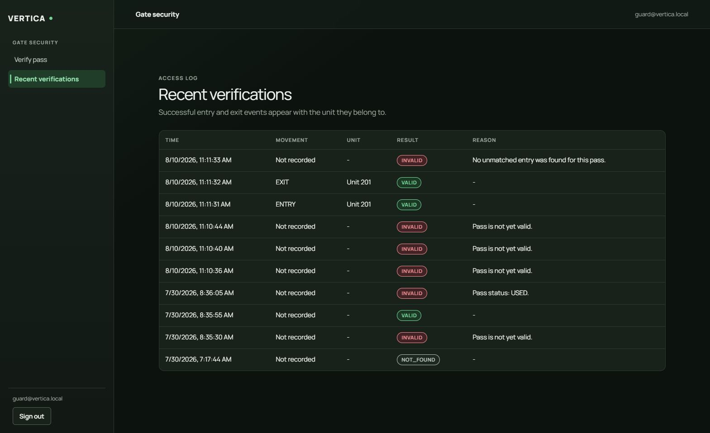

<div align="center">

# Vertica

**Web-Based Condominium Property Management System**

A modern, full-stack property management platform built for condominium administrators, tenants, and staff.


</div>

---

## Overview

Vertica is a comprehensive property management system designed for condominium buildings. It provides role-based portals for administrators, tenants, security guards, and maintenance staff — all powered by a modern Next.js stack with Supabase PostgreSQL for the database and authentication.

## Product Preview

### Public Experience



### Mobile Authentication



### Admin 3D Unit Management



### Guard Access History



## Features

### Public Marketing
- Landing page with live availability data
- Unit catalogue with filters and sorting
- Unit comparison (up to 3 units side-by-side)
- DSS recommendation engine (questionnaire → scored matches)
- Inquiry, viewing request, and reservation capture

### Admin Portal (`/admin`)
- Dashboard with occupancy stats
- Unit inventory management
- Client & inquiry pipeline (CRM)
- Lease management with conflict detection
- Billing overview and payment tracking
- Maintenance request queue
- Gate pass management and verification log
- Announcements (create, publish, target audiences)
- Reports & Analytics (occupancy, financial, maintenance, gate pass)
- User management and audit log viewer

### Tenant Portal (`/tenant`)
- Dashboard with quick links
- Bills and payment submission
- Maintenance request submission
- Gate pass creation and visitor management
- Announcements feed
- Notifications
- Profile management

### Guard Portal (`/guard`)
- 6-digit gate pass verification
- Real-time access grant/deny feedback
- Verification history log

### Maintenance Portal (`/maintenance`)
- Assigned work queue
- Request status tracking

## Tech Stack

| Layer | Technology |
|-------|-----------|
| Framework | Next.js 16 (App Router, Turbopack) |
| Language | TypeScript 5 |
| Database | Supabase PostgreSQL (hosted) |
| Auth | Supabase Auth (JWT, RLS) |
| Styling | Tailwind CSS 4 |
| Validation | Zod |
| Testing | Vitest (pgTAP for DB) |
| CI | GitHub Actions |

## Database

- **56 tables** across 14 migrations
- **Row Level Security (RLS)** on every table
- **5 roles**: SUPER_ADMIN, PROPERTY_ADMIN, TENANT, GUARD, MAINTENANCE
- **Append-only** audit logs and verification records
- **Exclusion constraints** for lease overlap prevention

## Getting Started

### Prerequisites

- Node.js 20+
- npm or yarn
- Supabase project (hosted or local)

### Installation

```bash
# Clone the repository
git clone https://github.com/Lester0961/vertica.git
cd vertica

# Install dependencies
npm install

# Set up environment variables
cp .env.example .env.local
# Edit .env.local with your Supabase credentials

# Apply database migrations
npm run db:apply:reset

# Seed demo users
npm run seed:users

# Start development server
npm run dev
```

### Environment Variables

| Variable | Description |
|----------|-------------|
| `NEXT_PUBLIC_SUPABASE_URL` | Supabase project URL |
| `NEXT_PUBLIC_SUPABASE_ANON_KEY` | Supabase anonymous/public key |
| `NEXT_PUBLIC_SITE_URL` | Canonical application URL used for auth redirects |
| `SUPABASE_SERVICE_ROLE_KEY` | Supabase service role key (server-only) |
| `APP_TIMEZONE` | IANA timezone used for property operations (default: `Asia/Manila`) |
| `DIRECT_URL` | Direct database connection (port 5432) |
| `DATABASE_URL` | Pooled database connection |

### Production Topology

- **Vercel** hosts the Next.js application and its server/API routes.
- **Supabase** provides PostgreSQL, Auth, Storage, and row-level security.
- **Brevo or Supabase Auth email** can send transactional messages on a free school-demo setup.

No separate Render service is required for the current architecture: the repository contains one full-stack Next.js application, and its API routes run with the Vercel deployment. Add a Render service only if a long-running worker or independently deployed backend is introduced later.

For the free presentation deployment, keep the Vercel-provided URL and use either Supabase's built-in Auth mailer or a verified Brevo single sender with `smtp-relay.brevo.com` on port `587`. No purchased domain is required for the classroom demo. Keep the SMTP key only in Supabase and never expose it through a `NEXT_PUBLIC_` variable. Free-provider rate limits still apply.

### Demo Accounts

After running `npm run seed:users`, all accounts use password: `Vertica!Demo123`

| Email | Role |
|-------|------|
| superadmin@vertica.local | SUPER_ADMIN |
| admin@vertica.local | PROPERTY_ADMIN |
| tenant@vertica.local | TENANT |
| guard@vertica.local | GUARD |
| maintenance@vertica.local | MAINTENANCE |

## Scripts

| Command | Description |
|---------|-------------|
| `npm run dev` | Start development server |
| `npm run build` | Production build |
| `npm run start` | Start production server |
| `npm run lint` | Run ESLint |
| `npm run typecheck` | TypeScript type checking |
| `npm run test` | Run Vitest tests |
| `npm run db:apply:reset` | Reset and reapply all migrations |
| `npm run seed:users` | Create/reset demo auth users |

## Project Structure

```
vertica/
├── src/
│   ├── app/                    # Next.js App Router pages
│   │   ├── (auth)/             # Login, password reset
│   │   ├── (public)/           # Marketing pages
│   │   ├── admin/              # Admin portal
│   │   ├── tenant/             # Tenant portal
│   │   ├── guard/              # Guard portal
│   │   ├── maintenance/        # Maintenance portal
│   │   └── api/v1/             # API endpoints
│   ├── components/             # React components
│   │   ├── design-system/      # Base UI components
│   │   ├── layout/             # Headers, footers, shells
│   │   ├── units/              # Unit-related components
│   │   └── ...                 # Feature components
│   ├── features/               # Feature modules
│   │   ├── announcements/      # Announcements queries + API
│   │   ├── auth/               # Auth actions
│   │   ├── billing/            # Billing queries + API
│   │   ├── crm/                # CRM API
│   │   ├── gate-passes/        # Gate pass queries + API
│   │   ├── maintenance/        # Maintenance queries + API
│   │   ├── property/           # Property queries
│   │   ├── recommendations/    # DSS engine + API
│   │   ├── reports/            # Reports queries + API
│   │   ├── staff/              # Staff queries + actions
│   │   ├── units/              # Unit queries + API
│   │   └── users/              # User mgmt queries + API
│   ├── lib/                    # Shared utilities
│   │   ├── api/                # API router, response helpers
│   │   ├── security/           # Auth, guard, roles
│   │   └── supabase/           # Supabase clients
│   └── types/                  # Shared TypeScript types
├── supabase/
│   ├── migrations/             # 14 SQL migrations
│   └── tests/                  # pgTAP database tests
├── scripts/                    # Build/seed scripts
└── public/                     # Static assets
```

## API Endpoints

All endpoints are under `/api/v1/`:

| Method | Path | Description |
|--------|------|-------------|
| GET | `/public/units` | Public unit catalogue |
| GET | `/public/units/:label` | Unit detail by public label |
| POST | `/recommendations` | DSS recommendation engine |
| POST | `/inquiries` | Submit inquiry |
| POST | `/viewing-requests` | Request viewing |
| POST | `/reservation-requests` | Request reservation |
| GET | `/billing/me/bills` | Tenant bills |
| POST | `/billing/me/payments` | Submit payment |
| GET/POST | `/maintenance/me/requests` | Tenant maintenance |
| GET/POST | `/gate-passes/mine` | Tenant gate passes |
| POST | `/gate-passes/verify` | Guard verification |
| GET/POST | `/announcements` | Announcements |
| GET | `/reports/*` | Admin reports |
| GET | `/users` | User management |
| GET | `/audit-logs` | Audit trail |

## Contributing

See [CONTRIBUTING.md](CONTRIBUTING.md) for guidelines.

## License

This project is licensed under the MIT License — see [LICENSE](LICENSE) for details.

## Acknowledgments

Built with [Next.js](https://nextjs.org/), [Supabase](https://supabase.com/), and [Tailwind CSS](https://tailwindcss.com/).
