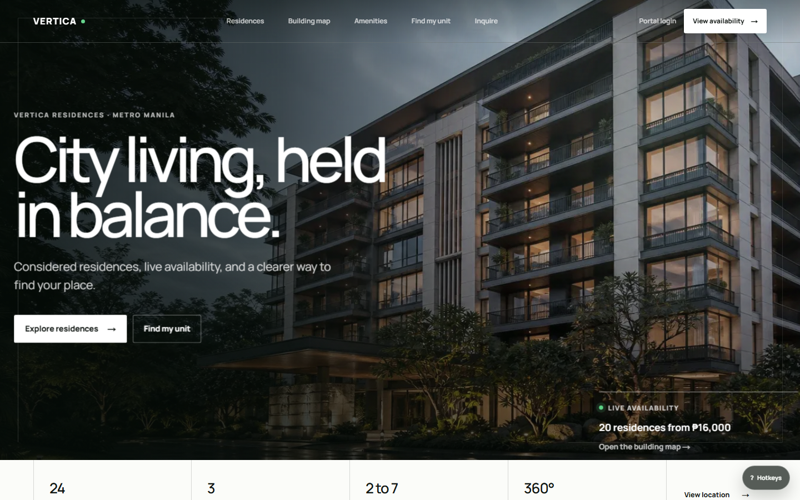

<div align="center">

# Vertica Residences

### Discover a residence. Manage the details. Feel at home.

**A condominium discovery and property management platform for residents and building teams.**

</div>

<p align="center">
  
</p>

<p align="center"><em>Current desktop view of the public landing page</em></p>

---

## About

Vertica brings residence discovery, property operations, and resident services together in one web application. Public visitors can explore units and request appointments; authenticated teams and residents use role-specific portals for day-to-day work.

The project is a fictional academic demonstration. Property details, prices, figures, and imagery are synthetic presentation material.

## What the system includes

| Area | Main capabilities |
| --- | --- |
| **Public experience** | Residence catalogue, availability filters, side-by-side comparison, interactive building and unit views, guided matching, inquiries, viewing requests, and reservation requests |
| **Property administration** | Dashboard, unit inventory, client and inquiry tracking, leases, billing and payments, maintenance, gate passes, announcements, reports, user access, and audit logs |
| **Resident portal** | Home and lease details, bills, payment submissions, maintenance requests, visitor passes, announcements, notifications, and profile settings |
| **Security portal** | Gate-pass verification and recent verification history |
| **Maintenance portal** | Assigned work, schedules, and request status updates |

## Technology

- **Application:** Next.js 16 App Router, React 19, and TypeScript 5
- **UI:** Tailwind CSS 4 and shared design-system components
- **Data and authentication:** Supabase Auth and PostgreSQL with row-level security
- **Validation:** Zod
- **Checks:** ESLint, TypeScript, and Vitest

## Run locally

### Requirements

- Node.js 20.9 or newer
- npm
- A local Supabase instance or a dedicated non-production project

### Setup

```powershell
git clone https://github.com/Lester0961/vertica.git
Set-Location vertica
npm ci
Copy-Item .env.example .env.local
```

Edit `.env.local` with credentials for a local or disposable development database. Do not use production credentials for local development. Then start the application:

```powershell
npm run verify-env
npm run dev
```

Open [http://localhost:3000](http://localhost:3000). Live availability and other data-backed pages need a working Supabase configuration.

### Configuration

| Variable | Use |
| --- | --- |
| `NEXT_PUBLIC_SUPABASE_URL` | Supabase project URL |
| `NEXT_PUBLIC_SUPABASE_ANON_KEY` | Browser-safe publishable key; database access must still be protected by RLS policies |
| `NEXT_PUBLIC_SITE_URL` | Application base URL used for authentication redirects |
| `APP_TIMEZONE` | Time zone for property operations; defaults to `Asia/Manila` |
| `SUPABASE_SERVICE_ROLE_KEY` | Optional server-side administrative tasks; never expose to the browser |
| `DIRECT_URL` / `DATABASE_URL` | Server-side database tooling; keep credentials private |

Keep `.env.local` out of version control. Only values intentionally prefixed with `NEXT_PUBLIC_` are suitable for browser exposure. Never place a service-role key or database password in a public variable.

## Database safety

Database migrations and demo-account creation are separate from starting the web app. The schema reset and demo-user seeder block non-local database targets by default. Use them only with a disposable development database, and never bypass those safeguards for production or shared resident data.

Migration files are kept in `supabase/migrations/`; database checks are in `supabase/tests/`.

## Useful commands

| Command | Purpose |
| --- | --- |
| `npm run dev` | Start the local development server |
| `npm run build` | Create a production build |
| `npm run start` | Serve a production build locally |
| `npm run verify-env` | Check required configuration and public-secret naming |
| `npm run lint` | Run ESLint |
| `npm run typecheck` | Check TypeScript types |
| `npm run test` | Run the Vitest suite |
| `npm run check` | Run the repository checks together |

## Repository map

```text
src/
  app/          Public pages, authentication, role portals, and API routes
  components/   Shared interface and feature components
  features/     Domain queries, API handlers, and mutations
  lib/          Authentication, role guards, Supabase clients, and utilities
supabase/
  migrations/   Database schema and policy changes
  tests/        Database checks
public/         Residence imagery and 3D assets
scripts/        Environment, migration, and asset utilities
screenshots/    Current README product preview
```

## Contributing and license

See [CONTRIBUTING.md](CONTRIBUTING.md) for contribution guidance. This project is licensed under the [MIT License](LICENSE).
